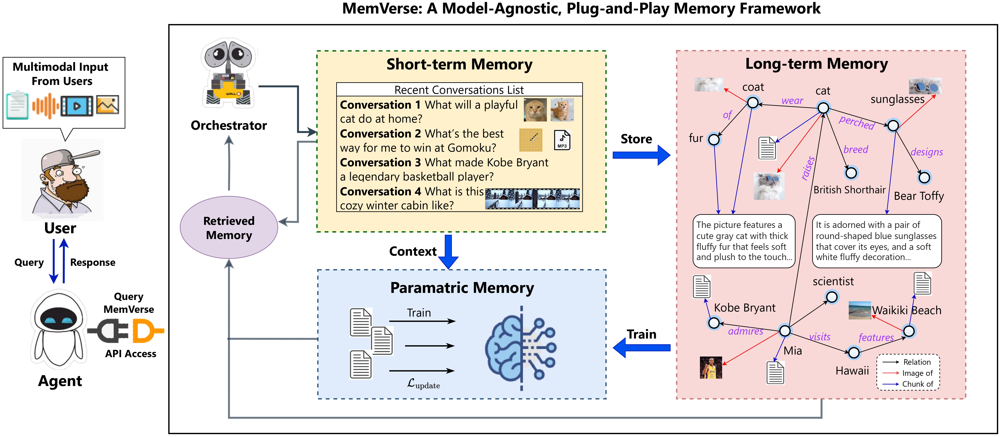
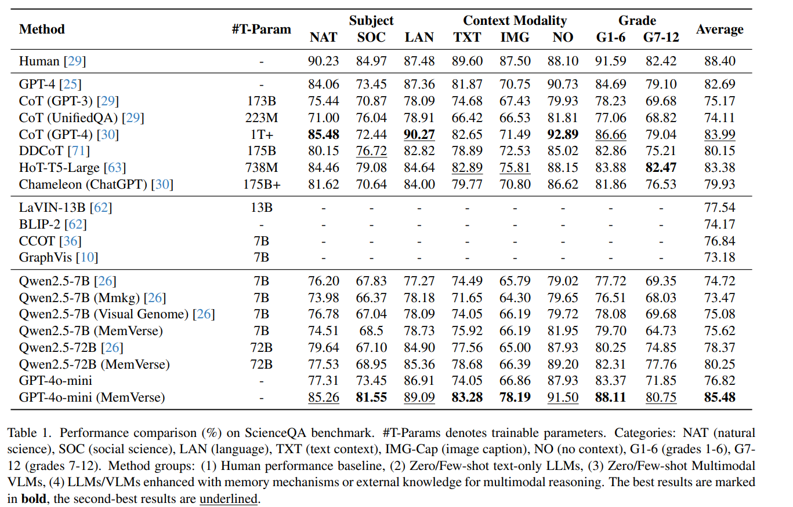
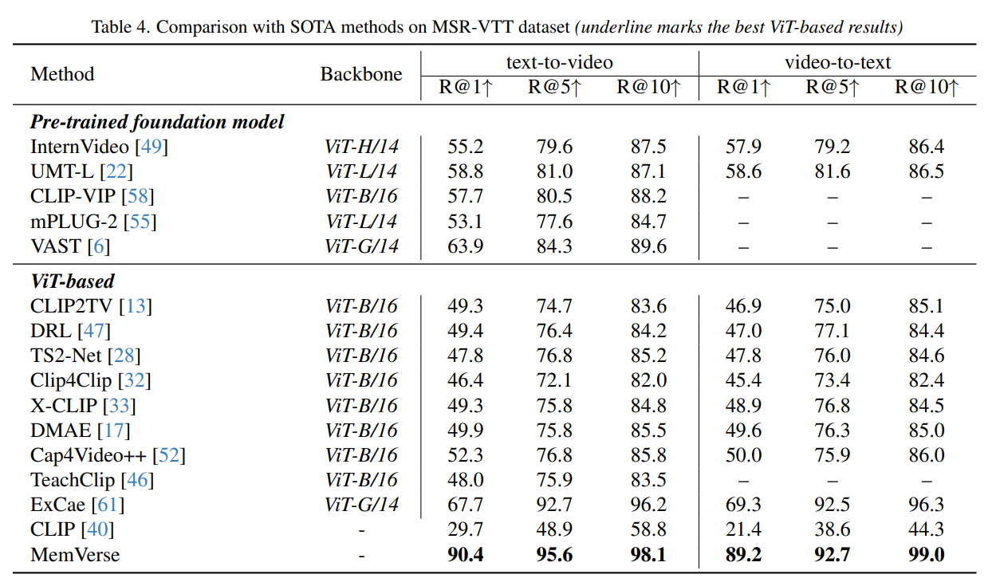

<h1 align="center">MemVerse: Multimodal Memory for Lifelong Learning Agents</h1>

<div align="center">

<p><strong>Weave moments into an everlasting cosmic memory: Enabling AI to reason, adapt, and recall across modalities</strong></p>

<p>
  
  
   <a href="https://github.com/Wings-Of-Disaster/MemVerse/releases">
    
  </a>
</p>

</div>

---

> 💬 **Reason, interact, remember — all in one universe.**

<!-- **MemVerse** is a next-generation **universal memory system** for AI agents.   -->
<!-- Unlike conventional AI that forgets past experiences, MemVerse allows agents not only to "remember" what happened, but also to "understand" the meaning behind these memories and use them to guide ongoing reasoning and decision making. In MemVerse-enabled demos, the system organizes recent interactions and multimodal experiences into structured long-term knowledge, helping AI to recall preferences, habits, and prior knowledge, much like a **friend who truly knows you**.   -->

**MemVerse** is an open-source framework designed to provide continuous, multimodal memory for AI agents. It organizes and retrieves information from text, images, and other sensory inputs, enabling agents to remember past interactions, understand context, and adapt dynamically. By structuring memories as hierarchical knowledge graphs and combining them with fast parametric recall, MemVerse empowers AI to reason, interact, and provide coherent, personalized experiences across extended conversations.

> 📄 **Paper Available on arXiv** — [https://arxiv.org/abs/2512.03627](https://arxiv.org/abs/2512.03627)

On benchmark evaluations, agents equipped with MemVerse achieve a reasoning accuracy of **84.48% on ScienceQA** and **90.40% on MSR-VTT**, demonstrating enhanced multimodal reasoning, adaptive learning, and coherent performance across extended interactions.

<p align="center">
  
</p>

---

## 📢 Latest Updates

<table>
<tr>
<td width="100%" style="border: none;">

**[2025-12-01] 🎉 🎉 🎉 MemVerse v1.0.0 Released!**

- ✨ **Stable Version**: The universal AI memory system is now officially open source  
- 📚 **Comprehensive Docs**: Quick start guides and full API reference included  
- 🖥️ **Interactive Demos**: Explore MemVerse with easy-to-use demonstration tools  

</td>
</tr>
</table>

---

## 🎯 Why MemVerse  
Build AI memory that continuously evolves, remembering what matters while automatically correcting past mistakes, so every memory grows from accurate understanding rather than meaningless accumulation.

**🌐 Fast Integration:** One-line install. Works with any LLM framework. No complex setup required.  

**🗂️ Multimodal Support:** Remember text, images, audio, and video. Process and retrieve across all modalities.

**⚡ Cost Efficient:** 90% token savings. Scale without breaking the bank.  

---

<!-- ## 📑 Table of Contents

- [📖 Project Introduction](#project-introduction)
- [🎯 System Framework](#system-framework)
- [🚀 Quick Start](#quick-start)
  - [Prerequisites](#prerequisites)
  - [Installation](#installation)
  - [How to Use](#how-to-use)
- [📊 Results](#results)
- [📖 Citation](#citation) -->


<!-- 
<a id="system-framework"></a>
## 🎯 System Framework

MemVerse operates along three complementary tracks: **short-term memory**, **long-term memory**, and **parametric memory**.  
- **Short-term memory** captures recent context and interactions in real time.  
- **Long-term memory** organizes experiences into structured knowledge for lasting recall.  
- **Parametric memory** provides fast, differentiable access to key information distilled from long-term memory.  

Together, these components form a cognitive loop that continuously updates, consolidates, and applies knowledge. Every response is grounded in immediate context, structured long-term knowledge, and adaptive parametric recall, enabling AI to reason, interact, and remember intelligently across extended conversations.

<p align="center">
  
</p> -->

<a id="quick-start"></a>
## 🚀 Quick Start

### Prerequisites

<!-- - **A GPU with at least 12GB VRAM** (for paramatric memory) -->
- Python 3.10+
- At least 4GB of available RAM (for memory storage)
- Access to the MemVerse API

### Installation

You can create a Conda environment and install dependencies using requirements.txt :
```bash
conda create --name memverse python=3.10
conda activate memverse
pip install -r requirements.txt
```
Or setup environment with provided YML :
```bash
conda env create -f environment.yml
```

### How to Use

1. **Start the MemVerse API server**

```bash
uvicorn app:app --host 0.0.0.0 --port 8000 --reload
```

2. **Insert new memory**

Send a POST request to `/insert` with text, image, video, or audio. Example using curl:

```bash
curl -X POST "http://127.0.0.1:8000/insert" \
  -F "query=Hello MemVerse!" \
  -F "image=@path/to/image.jpg" \
  -F "video=@path/to/video.mp4" \
  -F "audio=@path/to/audio.wav"
```

3. **Query memory**

```bash
curl -X POST "http://127.0.0.1:8000/query" \
  -F "query=Hello MemVerse!" \
```

<a id="results"></a>
### 📊 Results

<p align="center">
  
</p>

**ScienceQA:** MemVerse-enhanced GPT-4o-mini achieves an accuracy of **84.48%**, showing that parametric memory enables fast, context-aware reasoning even when questions have limited sequential dependencies. The model effectively integrates long-term knowledge for subject-specific reasoning in natural science, social science, and language tasks.

<p align="center">
  
</p>

**MSR-VTT:** By leveraging a memory-based knowledge graph and semantic associations between captions, MemVerse achieves **90.40% R@1** in text-to-video retrieval and **89.20% R@1** in video-to-text retrieval. This demonstrates that structured memory greatly enhances multimodal semantic matching, enabling lightweight models to retrieve relevant information efficiently while capturing rich reasoning from large pretrained models.


## Related Projects
 
Ecosystem & Extensions

<div align="center">

| | |
| :---: | :---: |
| <p align="center"> <a href="https://github.com/Wings-Of-Disaster/VaLiK"><span style="font-size: 30px;">&#128064;</span></a><br> <a href="https://github.com/Wings-Of-Disaster/VaLiK">**VaLiK**</a><br> <span style="font-size: smaller; color: gray;">Visual-Language Knowledge</span> </p> | <p align="center"> <a href="https://github.com/MintyCo0kie/MGA4OSWorld"><span style="font-size: 30px;">&#127760;</span></a><br> <a href="https://github.com/MintyCo0kie/MGA4OSWorld">**MGA4OSWorld**</a><br> <span style="font-size: smaller; color: gray;">Multi-Modal Goal-driven Agent</span> </p> |

</div>


<a id="citation"></a>
## 📖 Citation

If you use MemVerse in your research, please cite our paper (coming soon):

```
@misc{Liu_2025_MemVerse,
      title={MemVerse: Multimodal Memory for Lifelong Learning Agents}, 
      author={Junming Liu and Yifei Sun and Weihua Cheng and Haodong Lei and Yirong Chen and Licheng Wen and Xuemeng Yang and Daocheng Fu and Pinlong Cai and Nianchen Deng and Yi Yu and Shuyue Hu and Botian Shi and Ding Wang},
      year={2025},
      eprint={2512.03627},
      archivePrefix={arXiv},
      primaryClass={cs.AI},
      url={https://arxiv.org/abs/2512.03627}, 
}
```
